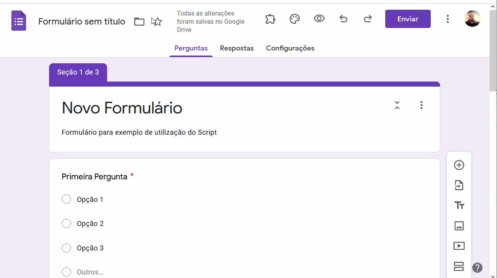
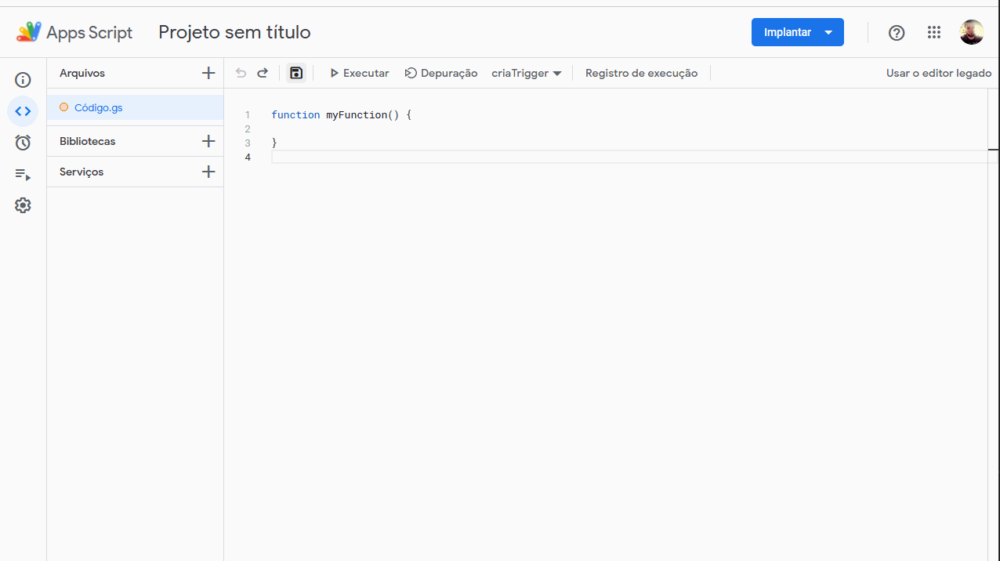
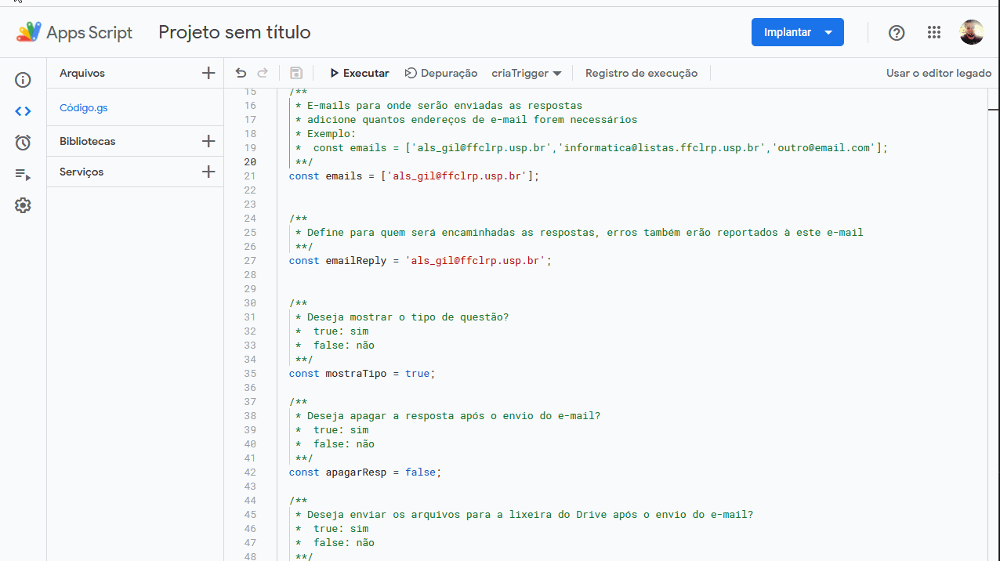
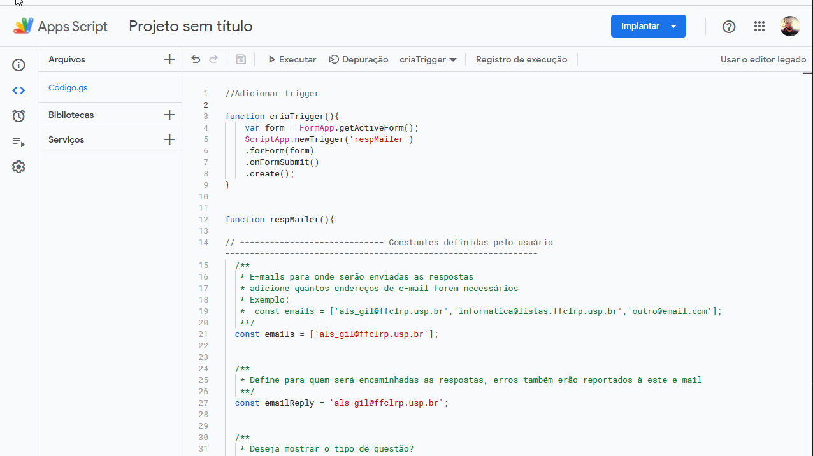

# Google Forms Mailer

.....

# Abra o Editor de Scripts 
Abra o formulário o qual você deseja que o script capte as respostas.

# Copie e Cole o código
Copie o código presente no arquivo `formManager.js` e cole no editor de scripts substituindo o conteúdo atual.

# Altere as constantes
Altera as constantes no início do código, através delas é possível:
* Controlar para quais e-mails serão enviadas as respostas
* Alterar para qual e-mail deverão ser encaminhadas as respostas das notificação (replyTo)
* Definir se as respostas deverão ser apagadas do formulário ou não
* Definir se or arquvios do Google Drive deverão ser enviados para a lixeira
* Definir se os tipos das perguntas serão mostrado na resposta

# Crie o Gatilho
Selecione a função criaTrigger e execute, demorará algum tempo processando e serão solicitadas permissões dos Apps Google.

